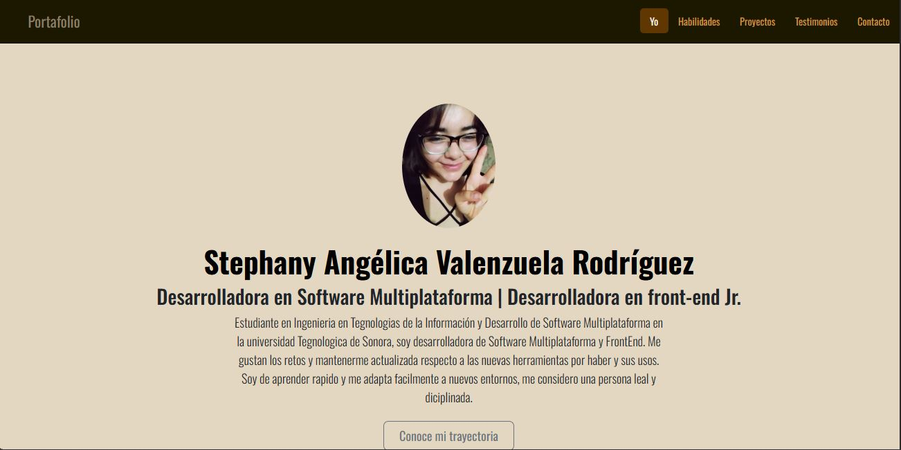

# Portafolio de Stephany Valenzuela
## Proyecto responsivo realizado con Bootstrap 5

Proyecto creado durando el *bootcamp* de _Tecnolochicas Pro_ y es adaptable a distintos dispositivos o tamaños de pantalla.
El propósito de esta página web es __mostrar mi portafolio como desarrolladora web__.💛

Aquí podrás acceder al proyecto [Portafolio](https://stephanyvlz.github.io/)

### Tecnologías utilizadas:

* HTML
* CSS
* BOOTSTRAP 5
* JAVASCRIPT

### El proyecto cuenta con las siguientes secciones:

* Sobre mí
* Habilidades
* Proyectos
* Testimonios
* Contacto

## Captura del proyecto
